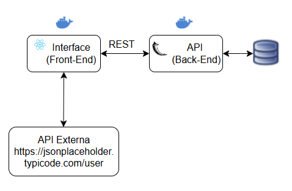

# 📌 mvp_back_python

API de gerenciamento de usuários construída com Flask, SQLite e documentada com Swagger (Flasgger). Este backend faz parte do projeto MVP e fornece endpoints para cadastro, consulta, edição e exclusão de usuários.

---

## 📌 1. Requisitos
Antes de iniciar a instalação, certifique-se de que seu ambiente atenda aos seguintes requisitos:

✔ **Python 3.8 ou superior** instalado  
✔ **Pip** (gerenciador de pacotes do Python) instalado  
✔ **Git** instalado (opcional, mas recomendado)  

Para verificar a instalação do Python e Pip, execute no terminal:

```bash
python --version
pip --version

```

Caso precise instalar o Python, faça o download em: [https://www.python.org/downloads/](https://www.python.org/downloads/)

---

## 📌 2. Clonando o Repositório
Se você deseja baixar o projeto diretamente do GitHub, use o comando abaixo:

```bash
git clone https://github.com/Frezende76/mvp_back_python.git

```

Caso contrário, você pode baixar o código compactado (.zip) e extraí-lo manualmente.

Entre no diretório do projeto:

```bash
cd mvp_back_python

```

---

## ⚙️ 3. Configuração Local

### 📌 1. Criando o Ambiente Virtual

```bash
python -m venv venv
```

### 2. Ativando o Ambiente Virtual

- **Windows**:

  ```bash
  venv\Scripts\activate

  ```
- **Linux/Mac**:

  ```bash
  source venv/bin/activate

  ```

---

### 📌 3. Instalando as Dependências

```bash
pip install -r requirements.txt

```

Caso precise atualizar o `requirements.txt` após instalar novos pacotes:

```bash
pip freeze > requirements.txt

```

---

### 📌 4. Iniciando o Servidor

```bash
python app.py ou Flask run

```

A API estará disponível em:
👉 http://localhost:5000

A documentação Swagger estará em:
👉 http://localhost:5000/swagger/

### OBS: Ao iniciar o servidor será criado automaticamente o banco de dados dados_cliente.db dentro da pasta databases.

---

## 🐳 4. Rodando com Docker (opcional)

> ⚠️ Recomendamos usar **Docker Compose** (ver seção 5).  
> Os comandos abaixo são apenas se você quiser rodar manualmente com Docker.

### 1. Buildar imagem

```bash
docker build -t mvp_back_python .

```

### 2. Subir container

```bash
docker run -d -p 5000:5000 --name mvp_back_python_container mvp_back_python

```

## 🧩 5. Usando Docker Compose

### 1. Subir o backend com Compose

```bash
docker-compose up --build

```

### 2. Caso necessite parar o container

```bash
docker-compose down

```

### 3. Acessar a API

👉 API: http://localhost:5000

👉Swagger UI: http://localhost:5000/swagger/


### OBS: Isso iniciará o backend na porta 5000 com acesso ao Swagger.

## 📌 6. Endpoints da API

| Método | Endpoint                     | Descrição                      |
|--------|------------------------------|--------------------------------|
| GET    | `/usuarios/todos`            | Listar todos os usuários       |
| POST   | `/usuarios/cadastrar`        | Cadastrar um novo usuário      |
| PUT    | `/usuarios/editar/{nome}`    | Editar um usuário pelo nome    |
| GET    | `/usuarios/consultar/{nome}` | Consultar um usuário pelo nome |
| DELETE | `/usuarios/excluir/{nome}`   | Excluir um usuário pelo nome   |


---

## 📌 7. Estrutura do Projeto

```
📂 mvp_back_python
│  │── 📂 databases
│  │   │── dados_cliente.db
│  │── 📂 models
│  │   │── usuario.py
│  │── 📂 routes
│  │   │── usuario_rotas.py
│  │── 📂 schemas
│  │   │── usuario_schema.py
│  │── app.py
│  │── docker-compose.yml
│  │── Dockerfile
│  │── fluxograma.png
│  │── README.md
│  │── requirements.txt

```
---

## 📌 8. Fluxograma da estrutura


---

## 📌 9. Contato

Desenvolvido por **Fabricio Rezende**. Para dúvidas ou sugestões, entre em contato.